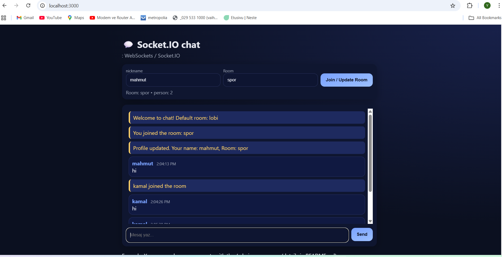
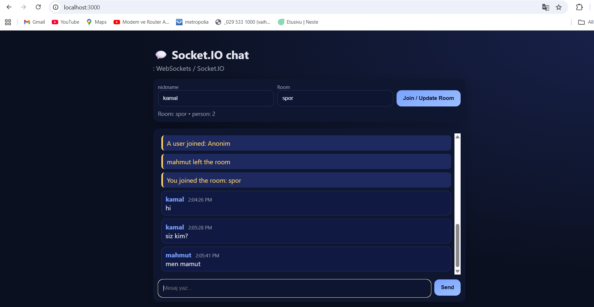
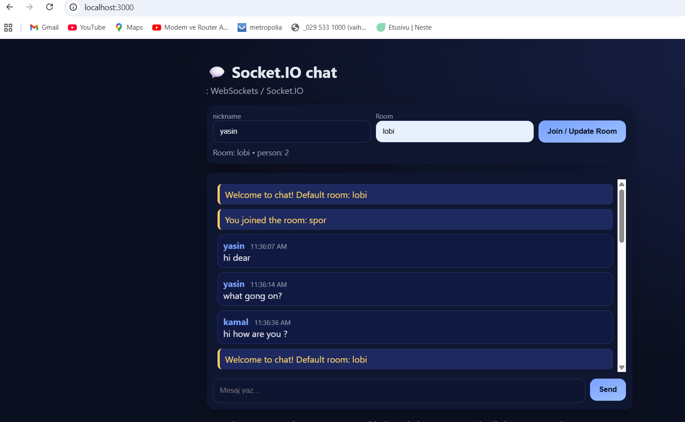

# Socket.IO Chat Application

A simple real-time chat application built with **Node.js**, **Express**, and **Socket.IO**.  
Supports **nicknames**, **rooms**, and **real-time messaging**.

---
# Install dependencies
npm install

# Run the app
npm run dev

# Then, open your browser at:

http://localhost:3000

# Usage

Open the app in one or more browser tabs.

Enter your nickname and a room name (default is lobby) and click Join / Update Room.

Type a message and click Send.

Open a second browser tab with the same room name to simulate another user and see real-time updates.

-

  
  
 